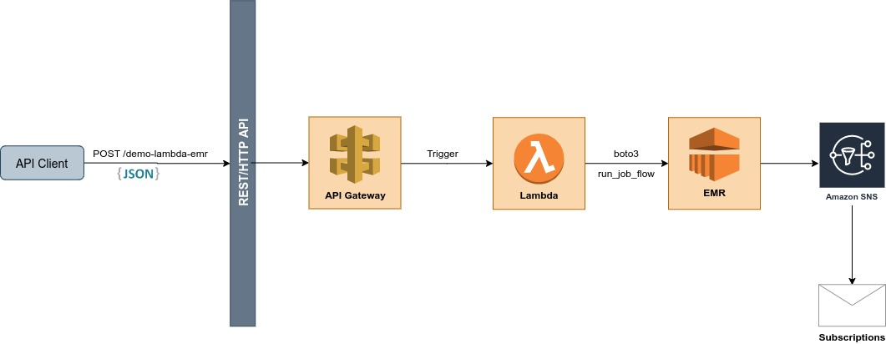
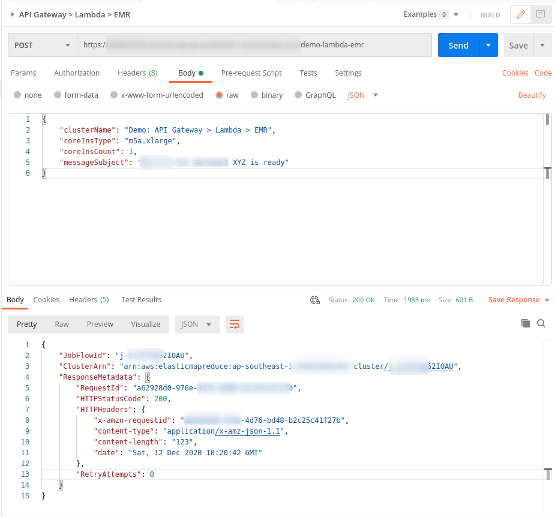
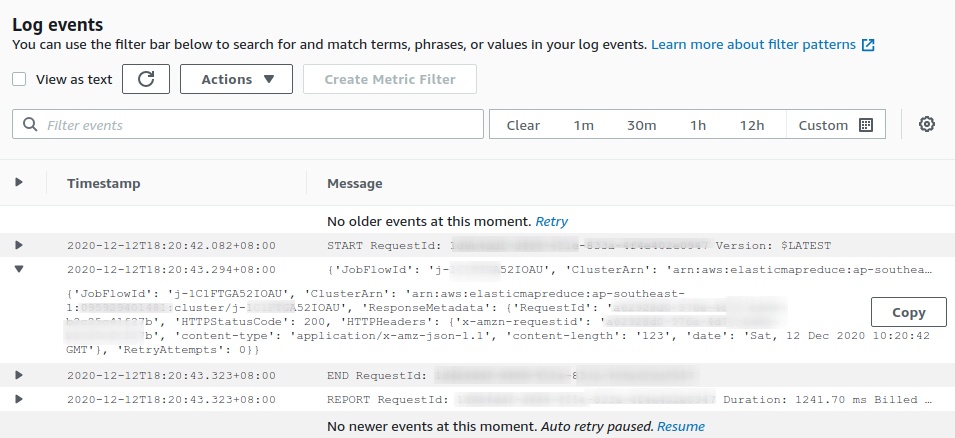
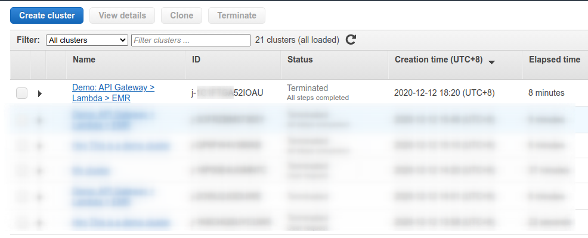
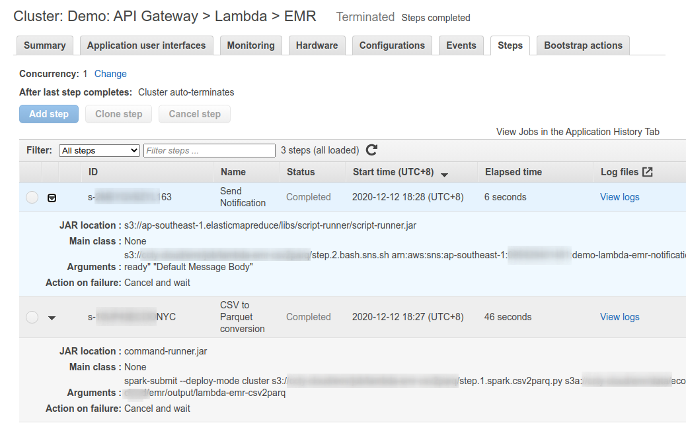
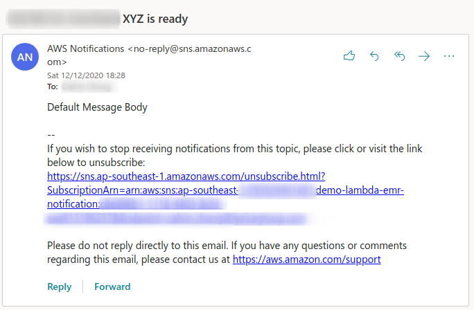
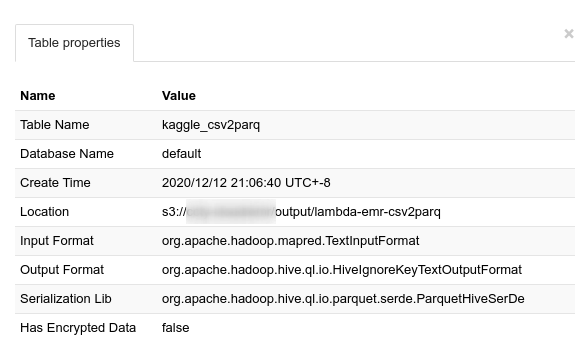
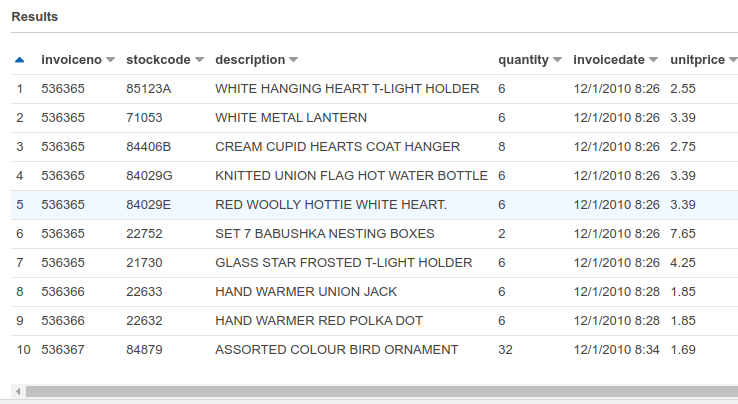
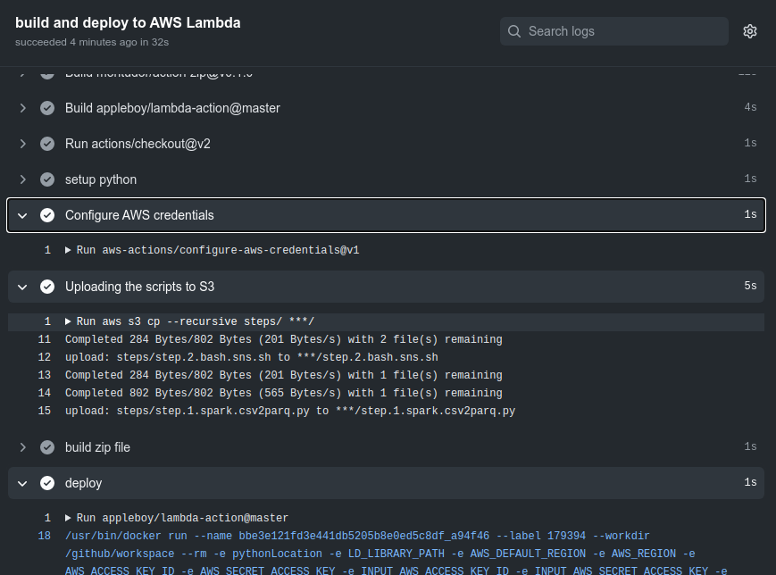

# Overview #

A lambda function (triggered by API Gateway) to spin up a EMR cluster and publish messages to SNS on EMR job completed.

---

## API Request ##
HTTP POST request with JSON body to override EMR cluster parameters

## Configurations ##
The EMR cluster configuration parameters are located at `utils/app_settings.py` (using environment variables in the Lambda function). Some of the parameteres could be override by the API payloads

## Lambda ##
Lambda function output in CloudWatch Logs

## EMR ##
The scripts located at `steps/` would be uploaded to the S3 before deploy to the AWS Lambda function in Github Action Workflow

> EMR Cluster

> EMR Cluster Steps

> SNS Email Notification

## Read Output in Athena ##

> Table Properties

> Table rows

## Github Action Workflow ##
* Upload spark and bash scripts to S3
* Deploy to AWS Lambda function on `main` branch commit pushed or pull-request merged

